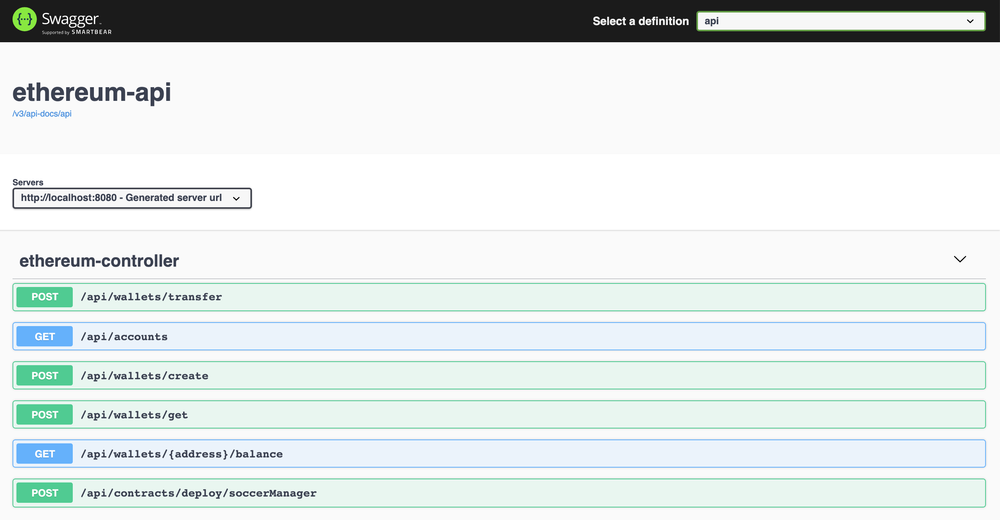

# springboot-web3j-ethereum

The goal of this project is to implement an **Ethereum Smart Contract** called `SoccerManager` (using [Solidity](https://solidity.readthedocs.io/en/latest) programming language) and deploy it to [Ethereum Blockchain](https://www.ethereum.org) running locally using [ethereum/client-go](https://github.com/ethereum/go-ethereum) docker image. Besides, we will develop three applications (`ethereum-api`, `player-api` and `player-ui`) that uses [Web3j](https://docs.web3j.io/getting_started.html) library to communicate with Ethereum blockchain and `SoccerManager` smart contract.

## Ethereum Smart Contract

`Ethereum Smart Contract` is a program that runs on an `EVM` (`Ethereum Virtual Machine`) similar to a Java program that runs on `JVM` (`Java Virtual Machine`). A contract is a collection of code (its functions) and data (its state) that resides at a specific address on the Ethereum Blockchain. Ethereum Smart Contracts are usually written in `Solidity` programming language.

[Remix](https://remix.ethereum.org) is a powerful, open source tool that helps you write contracts using Solidity straight from the browser. 

- **SoccerManager**

  `SoccerManager` is a smart contract that handles soccer players. Once deployed, it has some pre-defined soccer players registered. Initially, the agent of those pre-defined players is the owner of the contract (the wallet address used to deploy the contract). Besides, only the owner of the contract can add players. Other wallets (agent wallets) can buy soccer players and, once it is done, the agent wallet becomes the owner of the player.

## Applications

- **ethereum-api**

  [`Spring Boot`](https://docs.spring.io/spring-boot/docs/current/reference/htmlsingle/) application that communicates with Ethereum Blockchain, using `Web3j` library. `ethereum-api` provides some endpoints to create a new wallet, transfer ether from one wallet to another, etc.

  

- **player-api**

  `Spring Boot` application that calls `SoccerManager` smart contract `public functions` using `Web3j`. It exposes some endpoints so that you can buy a player, get info about the player, add players, etc.

  Some endpoints, such `POST /api/players/add`, requires the use of the **owner contract wallet**, i.e, the wallet that was used to deploy `SoccerManager` smart contract.

  

- **player-ui** (TODO)

  Frontend application that provides an User Interface to easily play with Ethereum Blockchain and `SoccerManager` smart contract. Using `Web3j`, it listens to `PlayerAdded`, `PlayerUpdated` and `PlayerBought` event emitted from `SoccerManager` contract (and some other logs from Ethereum Blockchain) and updates the screen on-the-fly. Besides, `player-ui` communicates directly with `player-api` whenever it needs some information from `SoccerManager` contract.

## Prerequisites

- `Java 11+`
- `Docker`
- [`jq`](https://stedolan.github.io/jq)

## Download & Unzip Web3j

- Go to https://github.com/web3j/web3j/releases/tag/v4.5.5 and download `web3j-4.5.5.zip`.
- Unzip to your preferred location. 

## Run Ethereum locally

- Open new a terminal
 
- Run the docker command below. It starts a container in development mode and exposes `Ethereum RPC API` on port `8545`.
  ```
  docker run -d --rm --name ethereum \
    -p 8545:8545 -p 30303:30303 \
    ethereum/client-go:v1.9.15 \
    --rpc --rpcaddr "0.0.0.0" --rpcapi="db,eth,net,web3,personal" --rpccorsdomain "*" --dev
  ```

  > Run the following command if you want to enter in the Geth’s interactive JavaScript console inside Docker container. It provides a lot of features such as: create an wallet, check waller balance, transfer ether from one address to another, etc. I won't focus on it because I decided to implement such features in `ethereum-api` using `Web3j`.
  > ```
  > docker exec -it ethereum geth attach ipc:/tmp/geth.ipc
  > ```
  > To stop the container run
  > ```
  > docker stop ethereum
  > ```

## Compile Smart Contract

- In a terminal, make sure you are inside `springboot-web3j-ethereum` root folder

- Export to `WEB3J_PATH` environment variable, the absolute path of `Web3j` that you [downloaded & unzipped](#download-&-unzip-web3j)
  ```
  export WEB3J_PATH=path/to/web3j-4.5.5
  ```

- Run the following script. It will compile Solidity `SoccerManager` code, `solidity/SoccerManager.sol`. When the compilation finishes, it will produce the files: `solidity/SoccerManager.abi` and `solidity/SoccerManager.bin`. Then, the script uses those two files to generate the `SoccerManager.java` on `ethereum-api` and `player-api`. 
  ```
  ./compile-generate-soccermanager.sh
  ```

## Starting applications

- **ethereum-api**

  - In a terminal and inside `springboot-web3j-ethereum/ethereum-api` folder, run the following command 
  ```
  ./mvnw clean spring-boot:run
  ```
  
  - Wait for the service to start.

- **player-api**

  - In a terminal, make sure you are inside `springboot-web3j-ethereum/player-api` folder

  - Create `contract owner` wallet & deploy `SoccerManager` contract
  
    1. Create the `contract owner` wallet
       ```
       CONTRACT_OWNER_WALLET=$(curl -s -X POST "http://localhost:8080/api/wallets/create" \
         -H "Content-Type: application/json" \
         -d "{ \"password\": 123, \"initialBalance\": 10000000000000000000}" | jq '.')
       
       CONTRACT_OWNER_WALLET_FILE=$(echo $CONTRACT_OWNER_WALLET | jq -r '.file')
       
       CONTRACT_OWNER_WALLET_ADDR=$(echo $CONTRACT_OWNER_WALLET | jq -r '.address')
       
       echo "### Contract owner wallet file => $CONTRACT_OWNER_WALLET_FILE"
       ```

    1. Deploy `SoccerManager` contract using the `contract owner` wallet
       ```
       export ETHEREUM_CONTRACT_SOCCERMANAGER_ADDRESS=$(curl -s \
         -X POST "http://localhost:8080/api/contracts/deploy/soccerManager" \
         -H "Content-Type: application/json" \
         -d "{ \"password\": 123, \"file\": \"$CONTRACT_OWNER_WALLET_FILE\", \"gasPrice\": 1,    \"gasLimit\": 3000000}")
       ```

  - To start `player-api`, go to `springboot-web3j-ethereum` root folder and run the following command 
    ```
    ./mvnw clean spring-boot:run
    ```

  - Wait for the service to start.

## Application URLs

| Application    | URL                                   |
| -------------- | ------------------------------------- |
| `ethereum-api` | http://localhost:8080/swagger-ui.html |
| `player-api`   | http://localhost:8081/swagger-ui.html |

## Test player-api

- Open a new terminal

- Run the following commands to create `new agent` wallet
  ```
  NEW_AGENT_WALLET=$(curl -s -X POST "http://localhost:8080/api/wallets/create" \
    -H "Content-Type: application/json" \
    -d "{ \"password\": 123, \"initialBalance\": 10000000000000000000}" | jq '.')
  
  NEW_AGENT_WALLET_FILE=$(echo $NEW_AGENT_WALLET | jq -r '.file')
  
  NEW_AGENT_WALLET_ADDR=$(echo $NEW_AGENT_WALLET | jq -r '.address')
  
  echo "### New agent wallet file => $NEW_AGENT_WALLET_FILE"
  ```

- Get player with id `1` using `new agent` wallet
  ```
  curl -s -X POST "http://localhost:8081/api/players/get" \
    -H "Content-Type: application/json" \
    -d "{ \"password\": 123, \"file\": \"$NEW_AGENT_WALLET_FILE\", \"gasPrice\": 1, \"gasLimit\": 3000000, \"playerId\": 1}" | jq '.'
  ```

- Buy player with id `1` using `new agent` wallet
  ```
  curl -s -X POST "http://localhost:8081/api/players/buy" \
    -H "Content-Type: application/json" \
    -d "{ \"password\": 123, \"file\": \"$NEW_AGENT_WALLET_FILE\", \"gasPrice\": 1, \"gasLimit\": 3000000, \"playerId\": 1, \"weiValue\": 1000000000000000000}" | jq '.'
  ```

- Get the players `new agent` has
  ```
  curl -s -X POST "http://localhost:8081/api/agents/players" \
    -H "Content-Type: application/json" \
    -d "{ \"password\": 123, \"file\": \"$NEW_AGENT_WALLET_FILE\", \"gasPrice\": 1, \"gasLimit\": 3000000}" | jq '.'
  ```

## Shutdown

- To stop `ethereum-api` and `player-api`, just to got their terminals and press `Ctrl+C`
- In order to stop `ethereum/client-go` docker container, run the following command in a terminal
  ```
  docker stop ethereum
  ```

## TODO

- implement `player-ui`

## References

- https://piotrminkowski.wordpress.com/2018/06/22/introduction-to-blockchain-with-java-using-ethereum-web3j-and-spring-boot/
- https://piotrminkowski.wordpress.com/2018/07/25/intro-to-blockchain-with-ethereum-web3j-and-spring-boot-smart-contracts/
