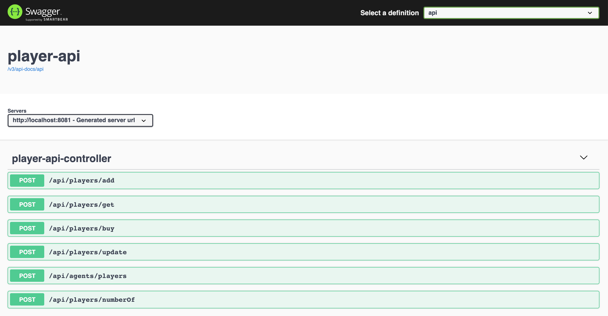

# springboot-web3j-ethereum

The goal of this project is to implement an **Ethereum Smart Contract** called `SoccerManager` (using
[Solidity](https://solidity.readthedocs.io/en/latest) programming language) and deploy it to
[Ethereum Blockchain](https://www.ethereum.org) running locally using
[ethereum/client-go](https://github.com/ethereum/go-ethereum) docker image. Besides, we will develop three Spring Boot
applications (`ethereum-api`, `player-api` and `player-ui`) that uses [Web3j](https://docs.web3j.io/getting_started.html)
library to communicate with Ethereum blockchain and `SoccerManager` smart contract.

## Ethereum Smart Contract

Ethereum smart contract is a program that runs on an EVM (Ethereum Virtual Machine) similar to a Java program that runs
on JVM (Java Virtual Machine). A contract is a collection of code (its functions) and data (its state) that resides at a
specific address on the Ethereum blockchain. Ethereum smart contracts are usually written in Solidity programming language.
[Remix](https://remix.ethereum.org) is a powerful, open source tool that helps you write contracts using Solidity straight
from the browser. 

### SoccerManager

`SoccerManager` is a smart contract that handles soccer players. Once deployed, it has some pre-defined
soccer players registered. Initially, the agent of those pre-defined players is the owner of the contract (the wallet
address used to deploy the contract). Besides, only the owner of the contract can add players. Other wallets (agent wallets)
can buy soccer players and, once it is done, the agent wallet becomes the owner of the player.

## Microservices

### ethereum-api

Spring-boot application that communicates with Ethereum blockchain, using `Web3j` library. `ethereum-api` provides some
endpoints to create a new wallet, transfer ether from one wallet to another, etc. The swagger website is http://localhost:8080/swagger-ui.html


### player-api

Spring-boot application that calls `SoccerManager` smart contract `public functions` using `Web3j`. It exposes some
endpoints so that you can buy a player, get info about the player, add more players, etc. The swagger website is
http://localhost:8081/swagger-ui.html.

- **PS. Some endpoints, such `POST /api/players/add`, requires the use of the contract owner wallet, i.e, the wallet that
was used to deploy `SoccerManager` smart contract.**



### player-ui (TODO)

Spring-boot application that provides an User Interface to easily play with Ethereum blockchain and `SoccerManager`
smart contract. Using `Web3j`, it listens to `PlayerAdded`, `PlayerUpdated` and `PlayerBought` event emitted from
`SoccerManager` contract (and some other logs from Ethereum blockchain) and updates the screen on-the-fly. Besides,
`player-ui` communicates directly with `player-api` whenever it needs some information from `SoccerManager` contract.

## Start environment

- Open a terminal and go to `springboot-web3j-ethereum` root folder

- Run the docker command below. It starts a container in development mode and exposes `Ethereum RPC API` on port `8545`.
```
docker run -d --name ethereum \
  -p 8545:8545 -p 30303:30303 \
  ethereum/client-go:v1.8.20 \
  --rpc --rpcaddr "0.0.0.0" --rpcapi="db,eth,net,web3,personal" --rpccorsdomain "*" --dev
```

> *NOTE*
> Run the command below if you want to enter in the Geth’s interactive JavaScript console inside Docker container. It provides
> a lot of features such as: create an wallet, check waller balance, transfer ether from one address to another, etc. I won't
> focus on it because I decided to implement such features in `ethereum-api` using `Web3j`.
> ```
> docker exec -it ethereum geth attach ipc:/tmp/geth.ipc
> ```

- Run the following script. It will compile Solidity `SoccerManager` code, `solidity/SoccerManager.sol`. When the
compilation finishes, it will produce the files: `solidity/SoccerManager.abi` and `solidity/SoccerManager.bin`. Then,
the script uses those two files to generate the `SoccerManager.java` on `ethereum-api` and `player-api`. 
```
./compile-generate-soccermanager.sh
```

## Starting micro-services

***Note. In order to run some commands/scripts, you must have [`jq`](https://stedolan.github.io/jq) installed on you machine***

### Start *ethereum-api*

- Inside `springboot-web3j-ethereum/ethereum-api`, run the following command 
```
mvn spring-boot:run
```

- Wait for the service to be up and running.

### Create contract owner wallet, deploy contract and start *player-api*

- Open a new terminal

- Run the following commands to create `contract owner` wallet
```
CONTRACT_OWNER_WALLET=$(curl -s -X POST "http://localhost:8080/api/wallets/create" \
  -H "Content-Type: application/json" \
  -d "{ \"password\": 123, \"initialBalance\": 10000000000000000000}" | jq '.')

CONTRACT_OWNER_WALLET_FILE=$(echo $CONTRACT_OWNER_WALLET | jq -r '.file')

CONTRACT_OWNER_WALLET_ADDR=$(echo $CONTRACT_OWNER_WALLET | jq -r '.address')

echo "### Contract owner wallet file => $CONTRACT_OWNER_WALLET_FILE"
```

- Deploy `SoccerManager` contract using the `contract owner` wallet
```
export ETHEREUM_CONTRACT_SOCCERMANAGER_ADDRESS=$(curl -s \
  -X POST "http://localhost:8080/api/contracts/deploy/soccerManager" \
  -H "Content-Type: application/json" \
  -d "{ \"password\": 123, \"file\": \"$CONTRACT_OWNER_WALLET_FILE\", \"gasPrice\": 1, \"gasLimit\": 3000000}")
```

- To start `play-api`, go to `springboot-web3j-ethereum/player-api` and run the following command 
```
mvn spring-boot:run
```

- Wait for the service to be up and running.

### Start *player-ui*

TODO

### Test *player-api*

- Open a new terminal

- Run the following commands to create `new agent` wallet
```
NEW_AGENT_WALLET=$(curl -s -X POST "http://localhost:8080/api/wallets/create" \
  -H "Content-Type: application/json" \
  -d "{ \"password\": 123, \"initialBalance\": 10000000000000000000}" | jq '.')

NEW_AGENT_WALLET_FILE=$(echo $NEW_AGENT_WALLET | jq -r '.file')

NEW_AGENT_WALLET_ADDR=$(echo $NEW_AGENT_WALLET | jq -r '.address')

echo "### New agent wallet file => $NEW_AGENT_WALLET_FILE"
```

- Get player with id `1` using `new agent` wallet
```
curl -s -X POST "http://localhost:8081/api/players/get" \
  -H "Content-Type: application/json" \
  -d "{ \"password\": 123, \"file\": \"$NEW_AGENT_WALLET_FILE\", \"gasPrice\": 1, \"gasLimit\": 3000000, \"playerId\": 1}" | jq '.'
```

- Buy player with id `1` using `new agent` wallet
```
curl -s -X POST "http://localhost:8081/api/players/buy" \
  -H "Content-Type: application/json" \
  -d "{ \"password\": 123, \"file\": \"$NEW_AGENT_WALLET_FILE\", \"gasPrice\": 1, \"gasLimit\": 3000000, \"playerId\": 1, \"weiValue\": 1000000000000000000}" | jq '.'
```

- Get the players `new agent` has
```
curl -s -X POST "http://localhost:8081/api/agents/players" \
  -H "Content-Type: application/json" \
  -d "{ \"password\": 123, \"file\": \"$NEW_AGENT_WALLET_FILE\", \"gasPrice\": 1, \"gasLimit\": 3000000}" | jq '.'
```

## TODO

- implement `player-ui`

## References

- https://piotrminkowski.wordpress.com/2018/06/22/introduction-to-blockchain-with-java-using-ethereum-web3j-and-spring-boot/
- https://piotrminkowski.wordpress.com/2018/07/25/intro-to-blockchain-with-ethereum-web3j-and-spring-boot-smart-contracts/
